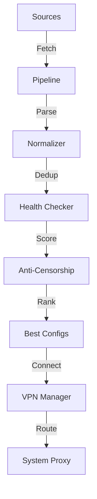

# v2ray-finder

**The most advanced V2Ray/Xray config finder with anti-censorship intelligence.**

[](https://pypi.org/project/v2ray-finder/)
[](https://pypi.org/project/v2ray-finder/)
[](https://opensource.org/licenses/Apache-2.0)

---

## Features

- **Find** configs from 30+ sources (GitHub, Telegram, subscriptions)
- **Test** with TCP, HTTP, and xray health checks
- **Score** with 8 dimensions including anti-censorship
- **Connect** with one click as a VPN
- **IPv6** support
- **Anti-censorship** levels 1-5 (Reality, XTLS, etc.)

## Quick Start

```bash
# Install
pip install v2ray-finder

# Connect to best server
v2ray-finder connect

# Or with anti-censorship filter
v2ray-finder connect --anti-censorship-level 4
```

## Anti-Censorship Levels

| Level | Protocol | Score | Description |
|-------|----------|-------|-------------|
| 5 (Maximum) | VLESS+Reality, VLESS+XTLS-Vision | 1.0 | Nearly undetectable |
| 4 (Strong) | WS+TLS, gRPC+TLS | 0.8 | Hard to block |
| 3 (Good) | mKCP, H2+TLS | 0.6 | Moderate obfuscation |
| 2 (Basic) | Standard TLS | 0.4 | Encrypted but identifiable |
| 1 (Weak) | Plain TCP | 0.1 | Easily detected |

## Documentation

<div class="grid cards" markdown>

-   **Getting Started**

    ---

    Install and configure v2ray-finder

    [:octicons-arrow-right-24: Installation](getting-started/installation.md)

-   **VPN Connection**

    ---

    Connect to servers as a VPN

    [:octicons-arrow-right-24: VPN Guide](features/vpn-connection.md)

-   **Anti-Censorship**

    ---

    Bypass censorship with advanced protocols

    [:octicons-arrow-right-24: Anti-Censorship](features/anti-censorship.md)

-   **CLI Reference**

    ---

    Complete command reference

    [:octicons-arrow-right-24: CLI Reference](reference/cli-reference.md)

</div>

## Architecture



## Community

- [GitHub](https://github.com/alisadeghiaghili/v2ray-finder)
- [PyPI](https://pypi.org/project/v2ray-finder/)
- [Issues](https://github.com/alisadeghiaghili/v2ray-finder/issues)

## License

Apache License 2.0 © 2026 Ali Sadeghi Aghili
